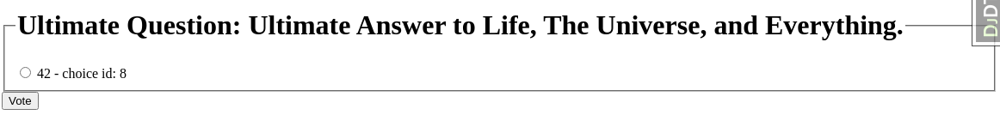
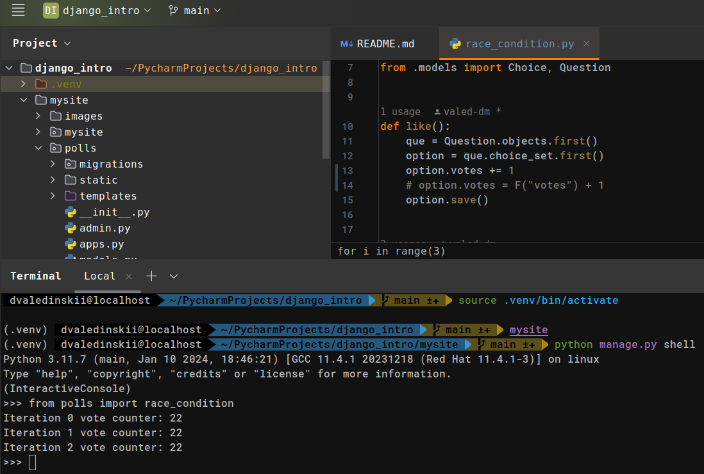
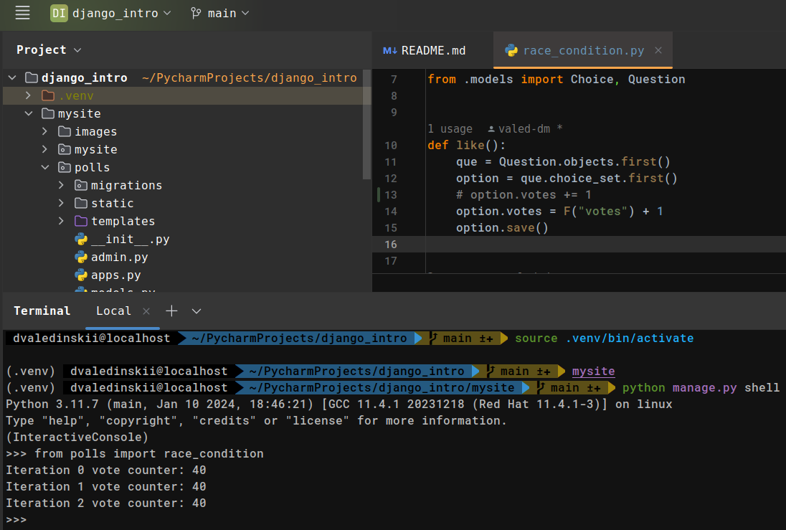
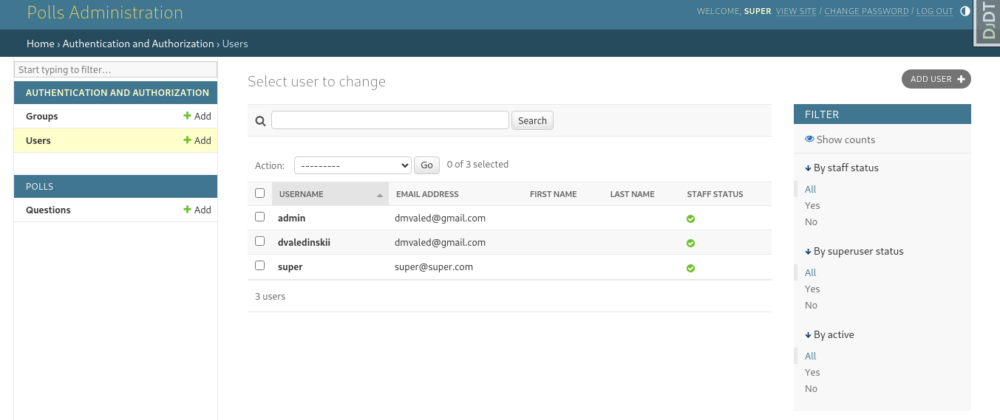
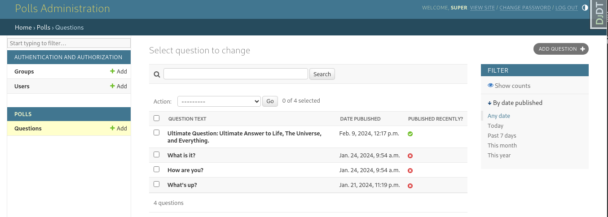
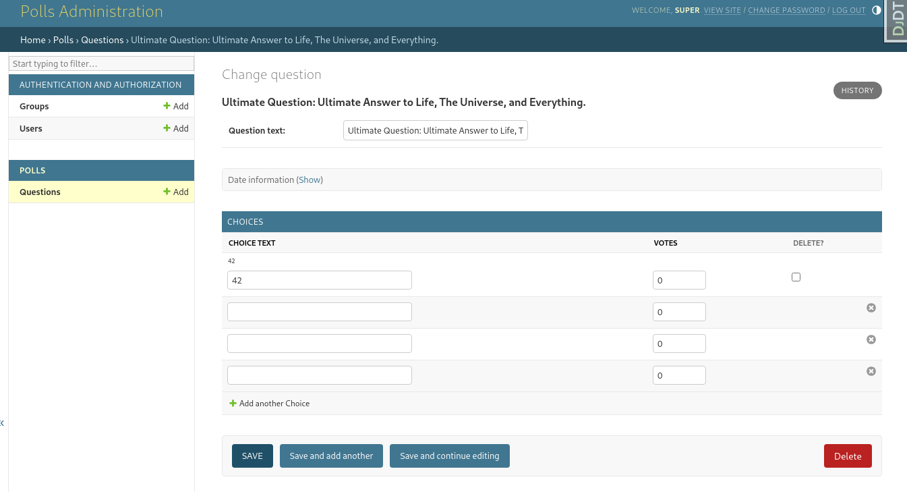
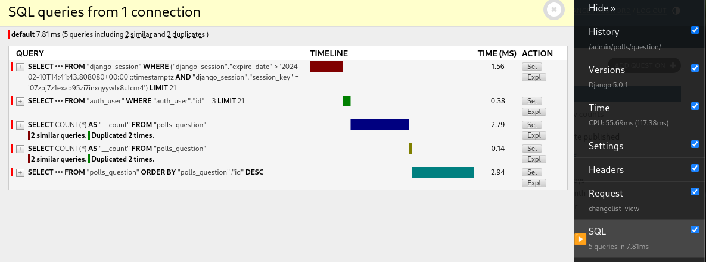
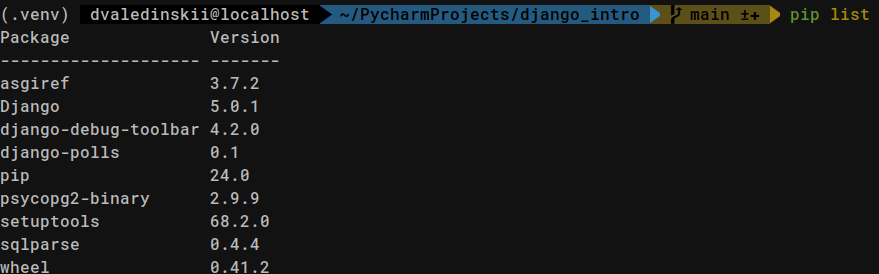

# django_intro
https://docs.djangoproject.com/en/5.0/intro/tutorial01/

### Первое приложение Django

- создание проекта
- создание приложения polls (опросы)
[]()

- urlpatterns: route, view, kwargs, name
- database setup, models
- создание admin user, superuser
- views, templates, render(), get_object_or_404()

углубился в вопрос race condition in Django (см. race_condition.py):
[]()

есть несколько вариантов решения:
с использованием F expression для инкремента значения:
[]()

с использованием атомарных транзакций:

https://github.com/valed-dm/cookbook/blob/dev/recipes/views.py:
```python
with transaction.atomic():
        for ing in ingredients:
            "'F' expression avoids retrieving the 'times_used' value from the database into Python memory."
            "It performs the increment operation directly at the database level"
            Ingredient.objects.filter(id=ing.ingredient.id).update(times_used=F("times_used") + 1)
```

с использованием get_or_create(), update_or_create():

```python
updated_values = {"unit": unit, "qty": qty}

    obj, created = RecipeIngredient.objects.update_or_create(
        recipe=recipe, ingredient=ingredient,
        defaults=updated_values
    )
```

- forms
- generic views
- automated testing
- static files
- настройка admin form
[]()
[]()
[]()


- Django Debug Toolbar
[]()


- создание пакета приложения
[](mysite/images/django_polls_installed.png)